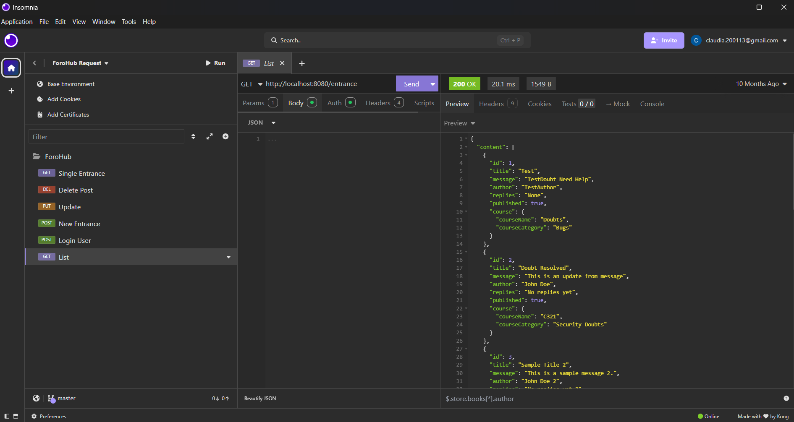
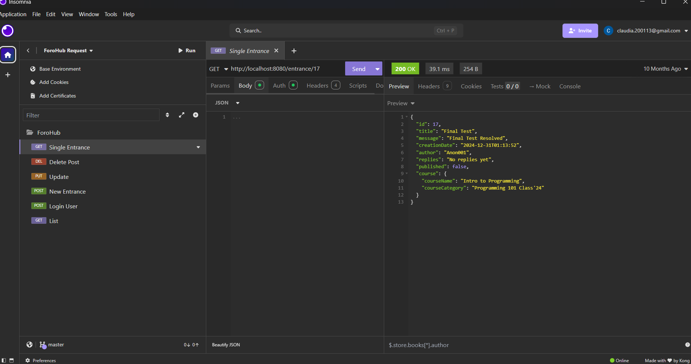

## Project Overview

ForoHub is a forum application created using **Java** and **Maven**. It leverages a **MySQL** server for data storage and was tested using **Insomnia**. The core functionality allows users to:

1. Create an account and validate their user identity through a token service.
2. Publish an entrance in the forum.
3. Edit an entrance.
4. List all entrances.
5. View an entrance in detail.
6. Unpublish an entrance (soft delete).

### Validations
- Users cannot submit incomplete information.
- Duplicate entrances or messages are prevented.

### Data Included in Each Entrance
- **Title**
- **Message**
- **Author**
- **Replies**
- **Status**: Published/Unpublished
- **Creation Date**: Auto-generated by MySQL
- **Course**: Includes Name and Category

## Features

- **CRUD Operations**: Create, Read, Update, and Delete entrances.
- **Validation**: Data validation using a custom `Validator`.
- **Pagination**: List entrances with pagination support.
- **Security**: API secured with bearer token authentication.
- **Transactional Integrity**: Updates and deletions are transactional.

## Insomnia 
**List of Entrances**

**Single Entrance**

